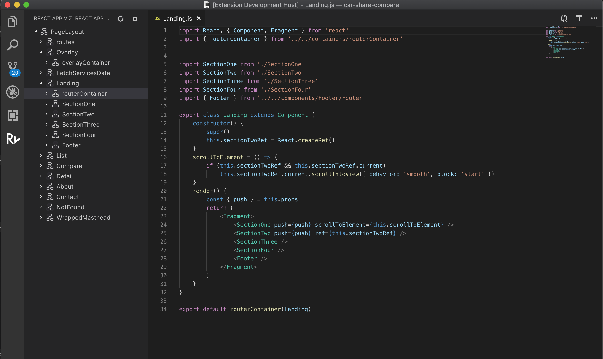

# React Viz

Visualize your React application's components with this extension.

### Why would I use this?

Have you ever worked through a bug in a large React code base and struggled to figure out where that component exists?

This extension helps you to visualize the heirachry of your React application's code base. When you're debugging a component and need to visualize where it exists in relation to other components you can rely on React Viz.

